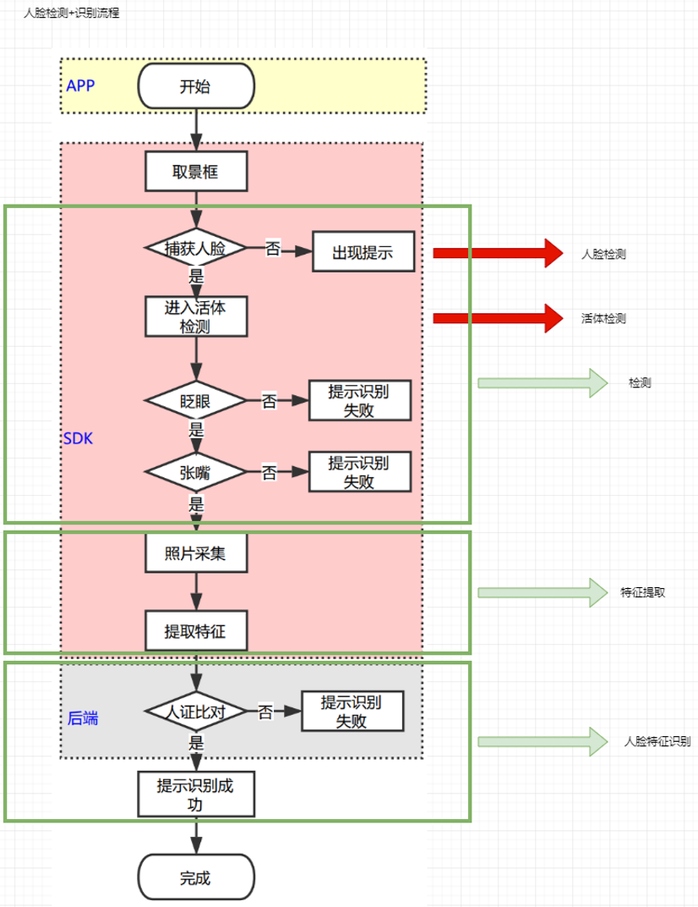
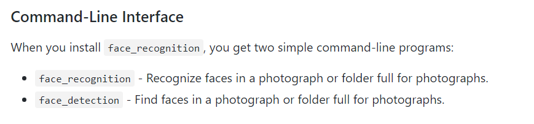

# 人脸识别检测学习
## 项目进展：
目前SRS的人脸识别项目还处于demo阶段，项目中的核心功能：人脸检测与识别是在开源函数库face_recognition上进行开发的。

## 外部依赖：
1. face_recognition 开源库
2. dlib 开源库

face_recognition函数库，在目前看来，是世界上最简洁的人脸识别库，使用者可以通过简单的python代码实现人脸的提取与识别，或者开发相关的应用程序。这个函数库中的人脸识别功能同时也是基于C++开源库dlib中的深度学习模型，根据创建者的数据，在使用Labeled Face in the Wild 人脸数据集进行测试时，有着高达99.38%的准确率，但是在识别亚洲特定年龄的人脸时，准确率有待提升。

## 项目细节：
### 识别模式：
SRS当前项目中的人脸识别应用有几个模式
1. cpu + HOG
2. cpu + cascade
3. gpu + HOG
4. gpu + cascade
5. cnn

（HOG 模式（histogram of oriented gradient，梯度方向直方图））

（cascade 模式（传统目标检测算法，级联分类器））

### 配套硬件：
当前，SRS项目测试中所使用的硬件设备是 intel realsens D415 立体相机。它的主要部件包括两个红外相机与一个红外激光发射器，在协同工作时可以获取被拍摄物体或场景的深度图像，在SRS的人脸识别项目中依靠此类图像对人脸进行活体检测；一个RGB相机，用于采集目标人脸的彩色图像，程序中的人脸识别功能依赖的就是此类图像。

根据我的理解，人脸检测与识别在一般情况下都是基于平面图像的，无论是灰度还是彩色图，但是更高级的检测与识别都是可以使用三维图像，具体的做法还不是很了解，也不知道face_recognition或dlib开源库是否有现成的对人脸三维数据进程操作的函数可供使用。

虽然目前还不了解SRS人脸检测与识别的具体流程，但是根据网上收集到的资料，一个完整的人脸识别流程包括两部分：1. 检测，2. 识别。

基于网上收集到的资料，人脸检测与识别的基本流程如图：

--- 

## Face Recognition 开源库
### face_recognition 人脸检测（**detection**）
face_recognition开源库已经实现了单张或多张照片的人脸检测，如下图：

对于这个开源库中的人脸检测函数`face_detection`，根据其定义可以了解其功能是找到图像中任何一张人脸的位置（像素坐标）, 人脸的上左下右像素坐标点。

### face_recognition 人脸识别（**recognition**）
如同上文人脸检测中所描述的，这个开源库也已经实现了单张或多张照片的人脸检测。

在执行这个函数的时候，输入包含已知人物的照片的目录与包含未知任务的照片的目录，函数会返回未知照片中匹配的人脸的人名，或没有匹配的被检测出来的人脸，标记为 unknown。

#### 调节容忍度/敏感读
如果对于同一个人有多个匹配，这可能代表着图像中的那些人都看起来比较相似。这时需要将这个函数的容忍值调低，是人脸对比更加严格（可以看出容忍值越低，人脸的**检测**精度越高）。

#### 加快人脸识别速度
如果程序的运行平台的中央处理器为多个核心，可以将人脸识别函数并行运算。

### Face Recoginition 开源库的 python 实例
#### 人脸检测
1. 找出照片中的人脸
2. 找出照片中的人脸（使用 deep learning） 
3. 找出批量图像中的人脸，使用 GPU （使用 deep learning）

#### 面部特征
1. 辨别照片中的特定面部特征
2. 应用数字化妆

#### 面部识别
1. 利用照片集中的已知人物找到并识别出照片中的未知人脸
2. 在照片中辨别并在每一个人的周围绘制长方体
3. 通过数字距离而不是 T/F 匹配来比较人脸
4. 在实时摄像头视频中识别人脸 -- 简单/低速版本（需要 opencv）
5. 在实时摄像头视频中识别人脸 -- 高速版本（需要 opencv）
6. 在视频文件中识别人脸并写出新的视频文件（需要 opencv）
7. 在树莓派上识别人脸，使用摄像头
8. 运行一个网络服务去识别人脸，通过 HTTP（需要 opencv）
9. 使用 KNN 分类器识别人脸
10. 对每一个人训练多张图像，然后使用 SVM 识别人脸

<u>关于 Face Recognition 的官方说明，还有很多是可以了解的，余下的一些条目</u>
- 创建一个独立的可执行应用
- 涵盖 face_recognition 函数的文章与指南
  - 人脸识别是如何工作的：使用 deep learning 的现代的人脸识别
  - adrian rosebrock：使用 OpenCV、python、deep learning 的人脸识别
  - adrian rosebrock：树莓派人脸识别
  - adrian rosebrock：使用 python 的人脸聚类
- 人脸识别是如何工作的（了解人脸定位与识别的机制，而不是依赖与函数库黑箱）

---

到目前为止
但是却没有活体检测的相关函

检测部分除了使用平面图像外还可以使用3D数据（人脸的立体图像，以点云数据或三角网格图像表现），此外，还可以加入活体检测和/或连续检测，前者用来判断用户是否是在进行真实的操作，主要是用来防止视频攻击，其主要的检测方法是指定用户做随机动作。

连续检测则是为了防止 
